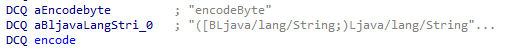

## adb相关操作
- 查看已链接设备信息  
adb devices
- 上传下载文件（单设备可以不写 -s 设备id号）  
adb -s 设备id号 push 电脑路径 手机路径  
adb -s 设备id号 oull 手机路径 电脑路径 
- 安装和卸载app  
  abd install 电脑apk文件路径   
  adb uninstall 包名称  
  adb shell pm list packages
- 查看手机处理器    
  adb shell -s 设备id号 getprop ro.product.cpu.abi    
  adb shell getprop ro.product.cpu.abi
- 进入手机内部，类似命令linux  
  adb shell # 进入手机中    
  ls # 查看所有路径

## firda启动
adb shell   
su  
cd ./data/local/tmp 
./frida-server  
电脑端配置：    
adb forward tcp:27042 tcp:27042     
adb forward tcp:27043 tcp:27043  

## frida检测  
- so文件做检测
```javascript
Java.perform(function () {
    // 查询到哪个so文件进行了闪退，可尝试删除
    var android_dlopen_ext = Module.findExportByName(null, "android_dlopen_ext");

    Interceptor.attach(android_dlopen_ext, {
        onEnter: function (args) {
            var path_ptr = args[0];
            var path = ptr(path_ptr).readCString();
            console.log("[dlopen_ext:]", path);
        },
        onLeave: function (retval) {}
    });
});
```
- ptrace占坑
- 检测frida运行特征  
使用frida增强版hluda（使用16.2.1版本最好）

## 代理检测
可以使用SocksDroid

## Hook so文件
```javascript
Java.perform(function () {
    //1  找到那个so文件，libJNIEncrypt.so，第二个参数是要hook的函数名--》返回值是函数的内存地址
    var addr_func = Module.findExportByName("libJNIEncrypt.so", "AES_128_ECB_PKCS5Padding_Encrypt");
    //2 传入要hook的函数内存地址
    Interceptor.attach(addr_func, {
        onEnter: function(args){
            console.log("--------------------------执行函数--------------------------");
            console.log("参数1-v11：", args[0].readUtf8String());
            console.log("参数2-v8：", args[1].readUtf8String());
        },
        onLeave: function(retValue){
            console.log("返回值newSign在md5之前的值:", retValue.readUtf8String());
        }

    })

});
```
## 脱壳
1. 电脑安装 pip install frida-dexdump  
2. 执行脱壳命令
   1. frida-dexdump -U -f 包名
   2. frida-dexdump -U -d -f 包名   #深度脱壳
3. 当前目录下生成一个文件夹，会有很多dex 使用jadx打开即可

## unidbg
方法的参数签名：

| Java      | Native      | Signature             |
|-----------|-------------|-----------------------|
| byte      | jbyte       | B                     |
| char      | jchar       | C                     |
| double    | jdouble     | D                     |
| float     | jfloat      | F                     |
| int       | jint        | I                     |
| short     | jshort      | S                     |
| long      | jlong       | J                     |
| boolean   | jboolean    | Z                     |
| void      | void        | V                     |
| 所有对象  | jobject     | L+classname +;        |
| Class     | jclass      | Ljava/lang/Class;     |
| String    | jstring     | Ljava/lang/String;    |
| Throwable | jthrowable  | Ljava/lang/Throwable; |
| Object[]  | jobjectArray | [L+classname +;       |
| byte[]    | jbyteArray  | [B                    |
| char[]    | jcharArray  | [C                    |
| double[]  | jdoubleArray | [D                    |
| float[]   | jfloatArray | [F                    |
| int[]     | jintArray   | [I                    |
| short[]   | jshortArray | [S                    |
| long[]    | jlongArray  | [J                    |
| boolean[] | jbooleanArray | [Z                    |

调用jni中的native方法时，需要传入参数，参数不是java类型，需要是unidbg提供的类型

| java类型           | 包裹                                           |
|------------------|----------------------------------------------|
| 字符串              | StringObject("字符串")                          |
| 字节数组{11，12}      | ByteArray(11,12)                             |
| 布尔：true/false    | true/false                                   |
| 数字：19            | 19                                           |
| 空：null           | null                                         |
| java自定义类型 info对象 | vm.resolveClass("路径/info类名").newObject(null) |

## AES加密
可尝试直接hook aes的加密类
```javascript
Java.perform(function () {
    var SecretKeySpec = Java.use("javax.crypto.spec.SecretKeySpec");
        var ByteString = Java.use("com.android.okhttp.okio.ByteString");
        SecretKeySpec.$init.overload('[B', 'java.lang.String').implementation = function (key, name) {
            if (name === 'AES') {
                console.log("-----------------SecretKeySpec-----------------");
                //console.log("4.key bytes=", JSON.stringify(key));
                console.log("java key hex =", ByteString.of(key).hex());
                //console.log("4.key", ByteString.of(key).utf8());
            }
            var res = this.$init(key, name);
            return res;
        };
    var IvParameterSpec = Java.use("javax/crypto/spec/IvParameterSpec");
    var ByteString = Java.use("com.android.okhttp.okio.ByteString");
    IvParameterSpec.$init.overload('[B').implementation = function (iv) {
        console.log("-----------------IvParameterSpec-----------------");
        //console.log("4.iv bytes=", JSON.stringify(iv));
        console.log("java iv hex =", ByteString.of(iv).hex());
        //console.log("4.iv", ByteString.of(iv).utf8());

        var res = this.$init(iv);
        return res;
    };
})
```

## JNI_OnLoad
1. 找到类 v4 = (v6[0], "com/duapp/aesjni/AESEncrypt");
2. 对应关系 (v3, v4, off_15010, 8LL); -> off_15010 有8个对应关系
3. 查看对应关系  
  
java中的方法：encodeByte  
根据签名：(byte[] bArr, String str)-->([BLjava/lang/String;)Ljava/lang/String;  
对应c中的方法：encode  
4. 双击进入encode后进行分析